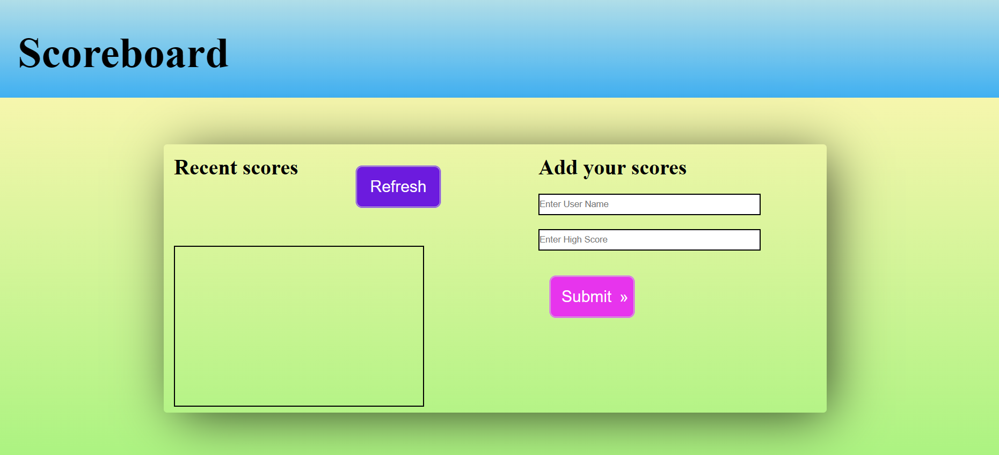

<!-- TABLE OF CONTENTS -->

# 📗 Table of Contents

- [📖 About the Project](#about-project)
  - [🛠 Built With](#built-with)
    - [Tech Stack](#tech-stack)
    - [Key Features](#key-features)
  - [🚀 Live Demo](#live-demo)
- [💻 Getting Started](#getting-started)
  - [Setup](#setup)
  - [Prerequisites](#prerequisites)
  - [Install](#install)
  - [Usage](#usage)
  - [Run tests](#run-tests)
  - [Deployment](#triangular_flag_on_post-deployment)
- [👥 Authors](#authors)
- [🔭 Future Features](#future-features)
- [🤝 Contributing](#contributing)
- [⭐️ Show your support](#support)
- [🙏 Acknowledgements](#acknowledgements)
- [❓ FAQ (OPTIONAL)](#faq)
- [📝 License](#license)

# 📖 LEADERBOARD 

*# 📖 Leaderboard

> This is Leaderboard website Users can add scores and names permanently in by using this Leaderboard webiste. I used HTML, CSS, JS and API in this project.
<table>
  <td style="border: 1px solid black;"></td>
  </table>

## 🛠 Built With 
- HTML
- CSS
- JS
### Tech Stack 

> I Used Gitflow, modules, and advanced JS (ES6) in the Leaderboard Project.

  
HTML

  <ul>
    <li><a href="https://www.w3schools.com/html/">HTML</a></li>
     <li><a href="https://www.w3schools.com/css/">CSS</a></li>
     <li><a href="https://www.w3schools.com/css/">Javascript</a></li>
  </ul>

<!-- Features -->

### Key Features 

- **[Html structure with Button, Inputs, etc]**
- **[Styling css with colors, borders, paddings, margins & sizes, etc]**
_ **[javascript functions, modules, ES6 syntax, variables, etc]**

(<a href="#readme-top">back to top</a>)

## 🔭 Future Features 

> I will Add style in this project with functions.

## 🚀 Live Demo 

> - [Live Demo Link](https://lovimadaan.github.io/Leaderboard/dist/)

<!-- GETTING STARTED -->

## 💻 Getting Started 

- Create a local directory that you want to clone the repository.

- Open the command prompt in the created directory.

- On the terminal run this command git clone https://github.com/LoviMadaan/Leaderboard.git

- Go to the repository folder using command prompt cd.

- Install the dev dependencies for linters run npm install.

(<a href="#readme-top">back to top</a>)

### Setup

> Clone this repository to your desired folder:

- git clone https://github.com/LoviMadaan/Leaderboard.git

<!-- AUTHORS -->

## 👥 Authors 

👤 **Lovi Madaan**

- GitHub: [LoviMadaan](https://github.com/LoviMadaan)
- Twitter: [@lovinarang](https://twitter.com/lovinarang)
- LinkedIn: [LoviMadaan]https://www.linkedin.com/in/lovi-madaan-b27439175

(<a href="#readme-top">back to top</a>)

<!-- CONTRIBUTING -->

## 🤝 Contributing 

Contributions, issues, and feature requests are welcome!

Feel free to check the [issues page](../../issues/).

(<a href="#readme-top">back to top</a>)

<!-- SUPPORT -->

## ⭐️ Show your support 

If you like this project you can clone it and use it.

(<a href="#readme-top">back to top</a>)

<!-- ACKNOWLEDGEMENTS -->

## 🙏 Acknowledgments 

I would like to thank my friends Yidne.

(<a href="#readme-top">back to top</a>)

<!-- LICENSE -->

## 📝 License 

This project is [MIT](./LICENSE) licensed.

(<a href="#readme-top">back to top</a>)

